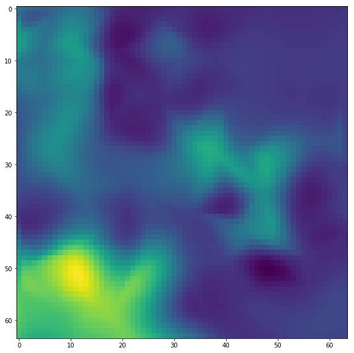

# montilecarlo

Uses monte-carlo-ish sampling of tile data to interpolate across larger areas.

```python
import os

from montilecarlo.tiles import MonteCarloTiles
from montilecarlo.tasks import process_tiles, load_tile, make_urls

from matplotlib.pyplot import figure, show


tile = [655, 1582, 12]
zoom = 18
MCT = MonteCarloTiles(tile, zoom, tilebuffer=2)

sampling = 0.025
sampletiles = MCT.generate_tiles(sampling, method='boxed')

total_possible_tiles = 4 ** (zoom - tile[-1])
print((sampling * total_possible_tiles, len(sampletiles)))


def get_weird(img):
    '''Rather than something useful,
    let look at the variance of a greyscale image
    flipped in 4 directions'''
    grey = np.mean(img, axis=2)
    return np.mean(np.var(np.dstack([
        grey[::a, ::b] for a, b in product([-1, 1], [-1, 1])
    ]), axis=2))


_, results = zip(*list(process_tiles(sampletiles,
                        os.environ['MAPBOX_ACCESS_TOKEN'],
                        [get_weird],
                        mapid='mapbox.satellite',
                        fmt='jpg')))


results = np.array(results)

fig = figure(figsize=(10, 10))
ax = fig.add_subplot(111)
ax.imshow(MCT.reinterpolate_tiles(sampletiles, results[:, 0], method='cubic'))
```

